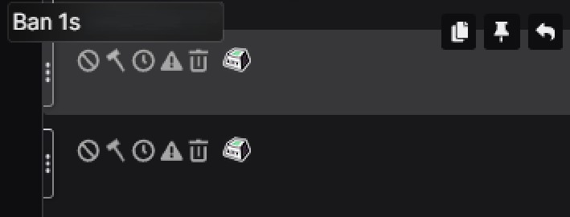

<p align="center">
  
  <h1 align="center">7TV Extension — Ban 1s</h1>
</p>

## Screenshot

<p align="center">
  
</p>

<p align="center">
  Модификация <a href="https://github.com/SevenTV/Extension">7TV Web Extension</a> с добавлением кнопки быстрого бана на 1 секунду в чате Twitch.
</p>

---

## Что изменено

Добавлена новая кнопка **Ban 1s** в панель модерации чата. Теперь рядом с обычными кнопками Ban, Timeout, Warn и Delete появилась дополнительная кнопка для мгновенного бана на 1 секунду.

### Расположение кнопок (слева направо):

| Кнопка | Действие |
|--------|----------|
| Ban | Перманентный бан |
| **Ban 1s** | Бан на 1 секунду (новая!) |
| Timeout | Таймаут на 10 минут |
| Warn | Предупреждение |
| Delete | Удалить сообщение |

> Кнопка Ban 1s отображается только для модераторов канала.

---

## Скриншот

<p align="center">
  
</p>

---

## Установка

### Chrome / Brave / Edge

1. Скачайте и распакуйте [последний релиз](https://github.com/aoooky/seventv-extension-ban1s/releases) или ZIP-архив
2. Откройте `chrome://extensions`
3. Включите **Режим разработчика** (Developer mode) в правом верхнем углу
4. Нажмите **Загрузить распакованное расширение** (Load unpacked)
5. Выберите папку `dist` из распакованного архива
6. Готово! Откройте Twitch и наслаждайтесь новой кнопкой

### Firefox

1. Скачайте и распакуйте релиз
2. Откройте `about:debugging#/runtime/this-firefox`
3. Нажмите **Загрузить временное дополнение** (Load Temporary Add-on)
4. Выберите файл `manifest.json` внутри папки `dist`

---

## Сборка из исходников

```bash
git clone https://github.com/aoooky/seventv-extension-ban1s.git
cd seventv-extension-ban1s
npm install
npx cross-env NODE_ENV=production npx vite build --config vite.config.mts
npx cross-env NODE_ENV=production npx vite build --config vite.config.background.mts
npx cross-env NODE_ENV=production npx vite build --config vite.config.content.mts
npx cross-env NODE_ENV=production npx vite build --config vite.config.worker.mts
```

Результат сборки будет в папке `dist/`.

---

## Основано на

- [SevenTV Extension](https://github.com/SevenTV/Extension) — оригинальное расширение
- Лицензия: MIT
